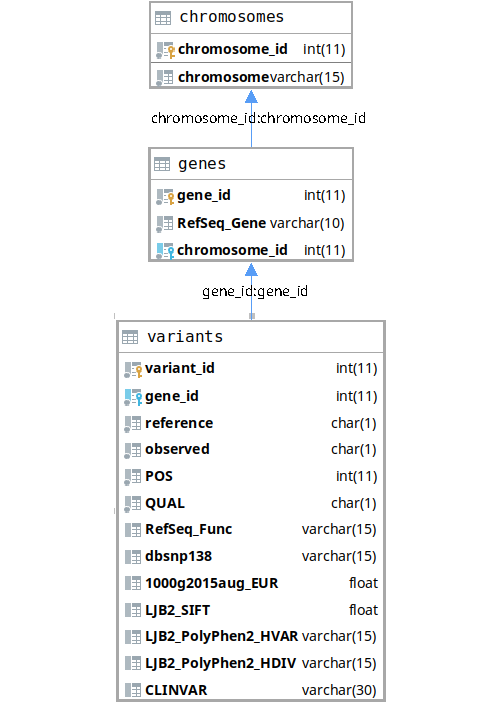

# Diagnostic Genome Analysis
Authors:  
* Rienk Heins
* Niek Scholten  
  
Below are descriptions of the created code for the project.
All files that were created for this project are contained in the [project](project) folder.

## Requirements  
Python3.6 or higher:  
A string formatting technique that was introduced in version 3.6 was used to improve readability.
[Deliverable 9](project/d9.py) has a slightly altered [version](project/d9_legacy.py) of itself, without the use of fstrings,
thus allowing it to run on any version. 

A mySQL database:  
A database is needed to store the information that has been generated by [Deliverable 9](project/d9.py).  
  
This flowchart represents the layout of the database that should be used.  
  
Python packages:
* tqdm == 4.36.1
* mysql-connector-python == 8.0.17

## Data
Multiple file types are used throughout the project, here are the ways used to get these files:

#### Pileup:
Generated by the MPileUp tool on [Galaxy](https://galaxy.bioinf.nl).

#### VCF:
Generated by the Varscan tool on [Galaxy](https://galaxy.bioinf.nl).

#### Annovar:
Generated by the ANNOVAR tool on [Galaxy](https://galaxy.bioinf.nl).

## Project

* ### [Deliverable 1](project/d1.py)
    **This script is used for converting BED files into dictionaries, that can be easily used later.**    
    Usage in terminal:
    ```
        python d1.py bed_file
    ```
    bed_file: A BED file.
    
* ### [Deliverable 2](project/d2.py)
    **This script processes pile-up files into easily usable dictionary.**  
    Usage in terminal:
    ```
        python d2.py bed_file pileup_file
    ```  
    bed_file: A BED file.  
    pileup_file: A pileup file.
    
* ### [Deliverable 3](project/d3.py)
    **This script processes pile-up files and maps the coverage. 
    All coverage data is written to a csv file.**  
    Usage in terminal:
    ```
        python d3.py bed_file pileup_file csv_file
    ```  
    bed_file: A BED file.  
    pileup_file: A pileup file.  
    csv_file: The name of the CSV file that will be created.
    
* ### [Deliverable 4](project/d4.py)
    **This script is the combination of d1, d2 and d3.
    It also uses multiprocessing to accelerate the process on multi-threaded machines.
    It uses BED and pileup-data to map the coverage and write the output to a csv file.**  
    Usage in terminal: 
    ```
        python d4.py bed_file pileup_file csv_file processors
    ```
    bed_file: A BED file.  
    pileup_file: A pileup file.  
    csv_file: The name of the CSV file that will be created.  
    processors: The amount of CPU's that will be used to run the script.

* ### [Deliverable 5](project/d5.py)
    **This script filters VCF data, the user defined frequency is used to filter out unwanted results.**  
    Usage in terminal:
    ```
        python d5.py -I vcf_file -O output_file -F frequency
    ```
    -I: Input file of the VCF type.  
    -O: Output file of the VCF type.  
    -F: Frequency thats used for the filter (30% by default).
    
* ### [Deliverable 6](project/d6.py)
    **Script used for checking ANNOVAR data for useful columns.**  
    Usage in terminal:
    ```
        python d6.py annovar_file
    ```
    annovar_file: A file of the .tsv or .tabular format.

* ### [Deliverable 7](project/d7.py)
    **This script uses regular expressions to filter out the names of genes of input data.**  
    Usage in terminal:  
    ```
        python d7.py
    ```

* ### [Deliverable 8](project/d8.sql)
    **SQL script that is used for the creation of a database.
    This database in particular has all of the needed tables and columns for storing the data generated at deliverable 9.**  
    Usage in terminal:
    ```
        mysql < d8.sql
    ```
    To create the tables, mysql must be run using the parameters -u and -p.  
    -u: Username.  
    -p: Password.

* ### [Deliverable 9](project/d9.py)
    **Script for filtering ANNOVAR data and placing it in the database.**  
    Usage in terminal:
    ```
        python d9.py -n database_name -u database_username -p password -f filename -s host_name
    ```
    -n: Name of the database.  
    -u: Username of the user connecting to the database.  
    -p: Password of the user.  
    -f: Filename of the .tsv or .tabular file.  
    -s: The hostname of the database.
    
* ### [Deliverable 9 Legacy](project/d9_legacy.py)
    **Script for filtering ANNOVAR data and placing it in the database.
    This script can be run on python 3.6 and lower, if d9.py does not work.**  
    Usage in terminal:
    ```
        python d9_legacy.py -n database_name -u database_username -p password -f filename -s host_name
    ```
    -n: Name of the database.  
    -u: Username of the user connecting to the database.  
    -p: Password of the user.  
    -f: Filename of the .tsv or .tabular file.  
    -s: The hostname of the database.
    
## Course Tools

* The [Galaxy](https://galaxy.bioinf.nl) workflow manager
* Bitbucket for completing the assignments
* Microsoft OneNote for writing the lab journal  

The languages used are:
* Python  
* SQL
