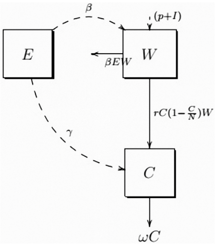

---
output:
  pdf_document:
    keep_tex:  true
    toc: true
    toc_depth: 2
    number_sections: true
    fig_caption: yes
    includes:
      before_body: title.tex
      in_header: header.tex
---
```{r setup, include = FALSE, warning = FALSE, message = FALSE}
knitr::opts_chunk$set(echo = FALSE)
knitr::opts_chunk$set(cache = TRUE)
knitr::opts_chunk$set(warning = FALSE)
knitr::opts_chunk$set(message = FALSE)
knitr::opts_chunk$set(error = FALSE)

BOSS_MODE <- TRUE
source('functions.R', local = knitr::knit_global())
knitr::read_chunk('functions.R')

packages <- c("deSolve", "ggplot2", "formatR", "scales", "ggpubr")
invisible(lapply(packages, library, character.only = T))
```

[//]: # (Page 4: Table of Contents)

\newpage

[//]: # (Page 5: Introduction)
\pagenumbering{arabic}
# Introduction
## Purpose
The effects of climate change are an existential threat to planet earth.
This paper's purpose is to reproduce and expand on the research done by E Duque-Marin to get a further understanding of the dynamics and different scenarios of fruit tree growth, and by extension shed light on a part of this humongous problem that is already cropping up around the world.

## Theory
The growth of the fruit tree is highly impacted by the different variables in- and outside the tree. To construct an impulsive model, an order of assumptions must be made:

1. The growth dynamics is governed by an interaction between the variables energy, water, vegetative growth.
2. The fruit tree responds instantly to the irrigation application.
3. The model concerned an adult fruit tree (older than 5 years) with a suitable soil surface for the growth of the fruit tree.
4. Ideal agronomic management conditions.
5. Optimal environmental conditions: The energy of the system is constant.

The parameters concerning the model are summarized in Table \ref{tab:tab1}.

| **Parameter** | **Meaning**                       |
|---------------|-----------------------------------|
| $q$           | Accumulated energy constant       |
| $r$           | Fruit trees intrinsic growth rate |
| $N$           | Fruit carrying capacity           |
| $I$           | Irrigation water amount           |
| $\beta$       | Evapotranspiration rate           |
| $\gamma$      | Photosynthetic contribution rate  |
| $\omega$      | Mortality rate of fruit trees     |

Table: Parameters used for the model \label{tab:tab1}

With that, the state variables can be denoted as following:

1. *E = E(t)* the solar radiation at time *t*;
2. *W = W(t)* the water amount in the soil at time *t*;
3. *C = C(t)* the fruit biomass concentration at time *t*.

Under assumption 5, the state variables are reduced to only *W* and *C*.
The variation of the amount of water in the system is denoted by *W'(t)* and the variation in biomass is denoted by *C'(t)*.
Considering there is no rainfall (p = 0), the water variation output is due to evapotranspiration at rate $\beta$.
Besides that, water is crucial for promoting the growth of the fruit tree at rate $r$.

C'(t) corresponds to the water input at a rate $r$; in addition, it is also positively affected due to the water-energy-biomass growth interaction at a rate $\gamma$.
There is an exit at an $\omega$ rate for the loss of natural death of the crop. This behavior applies to a continuous timescale (long duration), that governs the growth dynamics of the fruit tree.
However, this model also presents a short timescale (pulse) in discrete time that represents the events in which water enters the system through irrigation supply.

The dynamics between the variables energy, amount of water, and concentration of biomass of the fruit tree are shown in Figure \ref{fig:fig1}, adapted from [\ref{ref:ref1}];
where: *E* = Energy; *W* = Water amount; *C* = Fruit biomass concentration; $r$ = Fruit trees intrinsic growth rate; *N* = Fruit carrying capacity; $\beta$ = Evapotranspiration rate;
$\gamma$ = Photosynthetic contribution rate; $\omega$ = Mortality rate of fruit trees; $p$ = Rainfall rate; *I* = Irrigation amount.\newline


```{r, fig.cap = "\\label{fig:fig1}Diagram of dynamics", out.width = "50%", fig.align = "center"}

```


A model can be proposed that represents the growth dynamics of fruit trees, where the supply of irrigation is evidenced in the form of a pulse, and thus be described by impulsive differential equations \ref{eq:eq1}. The differential equations count when $t \ne nT$ and the latter two count when $t = nT$; with the default being $nT = 8$.

Equations:
$$
  \begin{array}{cc}
  W'(t) = -\beta qW(t) - rC(t)(1 - \frac{C(t)}{N} W(t) & \\
  C'(t) = rC(t)(1 - \frac{C(t)}{N})W(t) + \frac{\gamma qC(t)W(t)}{(C+1)(W+1)}-\omega C(1) & t \ne nT\\
  \Delta W(nT) = I & \\
  \Delta C(nT) = 0 & t = nT\\
  \end{array}
$$
\hfill (\label{eq:eq1}1.2)

\newpage

[//]: # (Page : Materials & methods)
# Materials and Methods
Since no datasets were used in the production of the results, the simulation data had to be generated.
This data was plotted using R graphics.

## Materials
The simulation data was obtained using the ODE (ordinary differential equation) function of the deSolve package.
This function takes differential equations and parameters and calculates the output of these functions.
Aforementioned equations can ben found in the theory section.
Other packages like ggplot2, ggpubr, formatR and scales were used in data visualisation. (\ref{tab:tab2})

| **Software** | **Package** | **Version** |
|--------------|-------------|-------------|
| R            |             | 4.0.4       |
|              | deSolve     | 1.32        |
|              | formatR     | 1.11.1      |
|              | ggplot2     | 3.3.5       |
|              | ggpubr      | 0.4.0       |
|              | scales      | 1.1.1       |

Table: Software and packages \label{tab:tab2}

The simulation data consists of an index, the $time$, water level in the soil ($W$) and biomass ($C$). (\ref{tab:tab3})

|     | **$time$** | **$W$**  | **$C$** |
|-----|------------|----------|---------|
| 1   | 0.00000    | 0.600000 | 1.00000 |
| 2   | 1.00000    | 0.556209 | 1.02602 |
| 3   | 2.00000    | 0.514991 | 1.05076 |
| 4   | 3.00000    | 0.476281 | 1.07421 |
| 5   | 4.00000    | 0.440001 | 1.09637 |

Table: The simulation data \label{tab:tab3}

## Methods
The differential equations were translated into a mathematical model that deSolve could understand.
The last two equations also needed to be incorporated; this was done through if/else statements checking the timestep.
After several tests were run to ensure parity with the described model in the paper. See Appendix \ref{appendix-b}

After this, the model was updated to use one-hour steps instead of one-day steps.
This lead to the model being adapted to incorporate different growth rates for day and night, for even more precise data.
See Appendix \ref{appendix-c}.

Another few models were made to compare different irrigation intervals, as well as a model for watering the soil as soon as almost all water was drained from it. See Appendix \ref{appendix-d} and \ref{appendix-e}.


\newpage

[//]: # (Page : Results/Resplication)
# Results
## Replication
The growth of the fruit trees can be shown in multiple simulations, tweaking a few variables to see the differences between these.
In Figure \ref{fig:fig2}a, the courses of the two state variables are shown: The water amount in the soil (blue) and the growth of the fruit tree's biomass (red).
Figure \ref{fig:fig2}b shows what happens with the growth of the fruit tree if the parameter *q* changes, for $q = 0.1$ in red, $q = 0.5$ in black (the default value), and $q = 1$ in blue.
The figures \ref{fig:fig2}c and \ref{fig:fig2}d conduct a delayed water irrigation in the model, with $nT = 16$.

```{r res1, file = 'results1.R', fig.cap = "\\label{fig:fig2}The different simulations", fig.height = 6}
```

\newpage

[//]: # (Page : Results/Expansion)

## Expansion
The following simulations show the difference between the expanded model accounting for day and night cycles in red, and the original model from [\ref{ref:ref2}] in black.
Figure \ref{fig:fig3} shows a decrease in overall biomass production, while steady growth is still retained.
This change has to do with the fact that a little under half of a 24-hour period is calculated as "no growth" night-time.

```{r res2, file = 'results2.R', fig.cap = "\\label{fig:fig3}The expanded simulation", fig.height = 6}
```

\newpage

[//]: # (Page : Results/Comparison)

## Comparison
Comparing different sets of irrigation data is vital to understanding the most efficient way of watering the fruit trees. Figure \ref{fig:fig4} shows the difference between the reference research from the paper and newly run simulations.

```{r res3, file = 'results3.R', fig.cap = "\\label{fig:fig4}The simulation comparisons", fig.height = 6}
```

\newpage

[//]: # (Page : Results/Desiccation)

## Desiccation
Figure \ref{fig:fig5} shows a scenario in which the trees only gets water when the water level in the soil is critically low. This is a simulation of the worst case scenario, achieved through dynamically programming a steady state.

```{r res4, file = 'results4.R', fig.cap = "\\label{fig:fig5}The edge case simulation", fig.height = 5}
```

\newpage

[//]: # (Page : Conclusion)
# Conclusion
In this work, simulations of an impulsive system of nonlinear differential equations were reproduced to describe the growth of fruit trees when exposed the application of water by irrigation.
These models were then expanded upon to incorporate day/night cycles for the trees to respond to.
The results of this work not only exhibit the positive effects of a well scheduled irrigation system, but also the negative effects of a system that is not well scheduled.
Results like these are very important factors in addressing problems that have to do with climate change induced drought.
All this culminates into the conclusion that artificial irrigation is an essential part of growing fruit trees in areas with frequent drought and decreasing rainfall as an effect of climate change.

\newpage

[//]: # (Page : Discussion)
# Discussion
* The day-night model does not conform assumption 5. Beside a non-constant energy output, the biomass should not grow in the evening, which should change the water loss for biomass to 0. Neither two were incorporated in the model.

\newpage

[//]: # (Page : References)
# References
```{r references, child = 'references.rmd'}
```

\newpage

[//]: # (Page : Appendix)
# Appendix
## Appendix A
```{r file = 'functions.R', attr.source = '.numberLines', echo = TRUE, fig.show='hide'}
```
\newpage

## Appendix B
```{r file = 'results1.R', attr.source = '.numberLines', echo = TRUE, fig.show='hide'}
```
\newpage

## Appendix C
```{r file = 'results2.R', attr.source = '.numberLines', echo = TRUE, fig.show='hide'}
```
\newpage

## Appendix D
```{r file = 'results3.R', attr.source = '.numberLines', echo = TRUE, fig.show='hide'}
```
\newpage

## Appendix E
```{r file = 'results4.R', attr.source = '.numberLines', echo = TRUE, fig.show='hide'}
```
