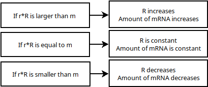

```{r setup, include = FALSE, warning = FALSE, message = FALSE}
knitr::opts_chunk$set(echo = TRUE)
knitr::opts_chunk$set(cache = TRUE)
```

```{r libaries, message = FALSE, warning = FALSE}
packages <- c("deSolve")
invisible(lapply(packages, library, character.only = T))
```

# Opdracht 1
In deze opdracht gebruiken wij het volgende model:
$$\frac{\Delta R}{\Delta t} = -r * R + m $$

* r is de mate waarin de transcriptie vervalt.
* R is de hoeveelheid transcriptie.
* m is de hoeveelheid transcriptie die per seconde wordt geproduceerd.

* [1] Welke parameters moet je programmeren?
  - Alle parameters van het rechterlid.
* [2] Zoek bronnen op internet die uitleggen waar de formule dR/dt = -rR + m vandaan komt.
  - https://www.math.arizona.edu/~faris/ode.pdf
  - https://arep.med.harvard.edu/pdf/Chen99.pdf
* [3] Teken het biologische model en leg de vertaling naar de formule uit.
  - 
  - Dit model legt uit wat de invloed is van een veranderende transcriptie factor op het uiteindelijk geproduceerde mRNA.
* [4] Wat is de return waarde van de model functie in R? Waarom return je die en niet R zelf?
  - De return waarde is $$\frac{\Delta R}{\Delta t}$$, je returnt deze omdat R niet verandert.


```{r}
## Define model
volume <- function(t, y, parms){
  with(as.list(parms),{
    dY <- -r * y + m
    return(list(dY))
  })
}

## Initial state
state <- c(Volume = 100)

## Timeframe
times <- seq(0, 10, by = 0.01)

## Parameters
params1 <- c(m = 60, r = 0.5)
params2 <- c(m = 40, r = 0.5)
params3 <- c(m = 50, r = 0.5)

incr <- ode(times = times, y = state, parms = params1, func = volume, method = "euler")
decr <- ode(times = times, y = state, parms = params2, func = volume, method = "euler")
stead <- ode(times = times, y = state, parms = params3, func = volume, method = "euler")

plot(incr, type = "l", main = "Number of mRNA transcripts overtime",
     ylab = "mRNA transcripts", xlab = "Timepoints", col = "green", ylim = c(80, 120))
lines(decr, col = "red")
lines(stead, col = "blue")
legend("topleft", legend = c("m = 60", "m = 50", "m = 40"), fill = c("green", "blue", "red"))
```
